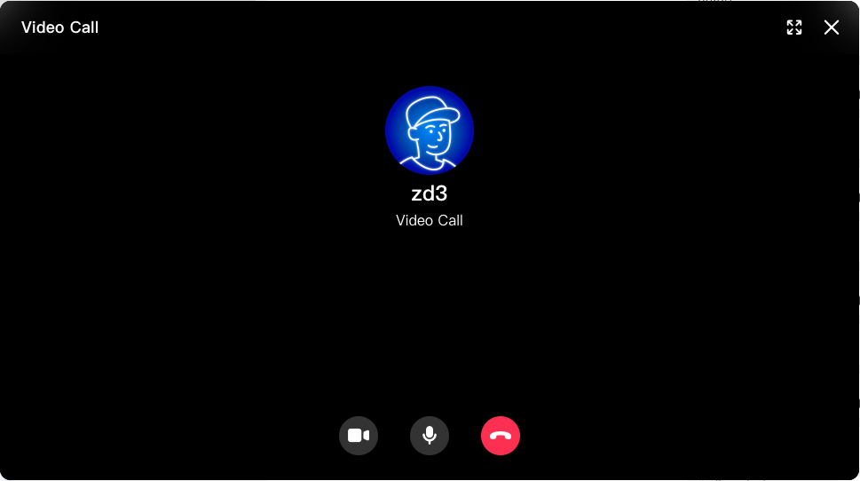
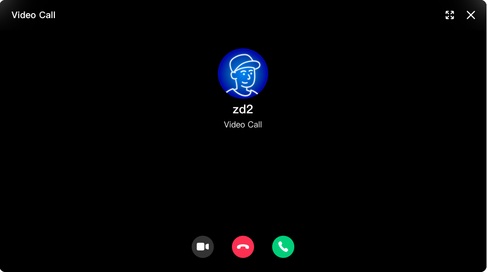

# 实现一对一音视频通话

chat-callkit 是一套基于声网音视频服务，使用 Agora Chat 作为信令通道的开源音视频 UI 库。该库提供一对一语音通话、视频通话，以及多人会议的功能接口。同时，通过信令的交互确认，还可以保证用户在多个设备登录时，能同步处理呼叫振铃，即当用户在一台设备上处理振铃后，其他设备自动停止振铃。

本文展示如何使用 chat-callkit 快速构建实时音视频场景。

## 实现原理

使用 chat-callkit 实现音视频通话的基本流程如下：

1. 用户调用 chat-callkit 的初始化接口。
2. 主叫方调用发起通话邀请接口，自动进入通话页面。
3. 被叫方调用接听接口弹出通话请求页面，在 UI 界面选择接听，进入通话。
4. 结束通话时，点击 UI 界面的挂断按钮。

## 前提条件

开始前请确保你的项目满足如下条件：

-   有一个实现了基础的实时消息功能的 React 项目，包含用户登录登出、添加好友、创建群组等。
-   一个有效的 Agora 账号，并开通了 Token 认证。
-   一个有效的 Agora Chat 账户。

## 项目设置

参考如下步骤，将 chat-callkit 集成到你的项目中，并完成相关配置。

### 引入 chat-callkit

参考下文步骤使用 npm 将 chat-callkit 导入到项目中。

1. 下载 chat-callkit。

```bash
npm install chat-callkit
```

2. 引入 chat-callkit。

```javascript
import Callkit from 'chat-callkit';
```

## 实现音视频通话

参考如下步骤在项目中实现一对一实时音视频通话。

### 初始化

调用 `init` 进行初始化。

```javascript
CallKit.init(appId, agoraUid, connection);
```

参数说明：

-   appId：声网 App ID。
-   agoraUid: 声网的 uid。
-   connection：Agora chat 实例。

### 发起通话邀请

调用 `startCall` 方法，发起通话邀请。你需要在该方法中指定通话类型。

-   一对一通话
    一对一通话会向对方发送一个文本消息作为邀请。

```javascript
let options = {
	callType: 0, // 0 1v1 语音，1 1v1视频， 2 多人视频， 3 多人语音
	chatType: 'singleChat', // 单聊
	to: 'userId', // 对方的 Agora chat userId
	message: '邀请你加入语音', // 邀请消息的文本
	channel: 'channel', // 自己生成的 channel name，让对方加入相同的 channel
	accessToken: '声网 token', // 后面介绍怎么获取声网 token
};
CallKit.startCall(options);
```

-   发起多人通话
    多人通话会向群里发送一个文本消息，同时向被邀请的人发送 CMD 消息进行邀请。

```javascript
let options = {
	callType: 2, // 0 1v1 语音，1 1v1视频， 2 多人视频， 3 多人语音,
	chatType: 'groupChat',
	to: ['userId'], // 被邀请的用户 Agora chat userId
	message: '邀请你视频通话',
	groupId: 'groupId', // 群组 ID
	groupName: 'group name', // 群组名称
	accessToken: '声网 token', // 后面介绍怎么获取声网 token,
	channel: 'channel', // 自己生成的 channel name，让对方加入相同的 channel,
};
CallKit.startCall(options);
```

发起通话后的 UI 界面如下：


### 多人通话中再邀请其他人

在多人通话中想要再邀请其他人，可以点击右上角的 "添加人" 按钮，点击之后会触发 `onAddPerson` 回调，触发 onAddPerson 之后，需要用户要实现选择要邀请的人功能，在选择好要邀请的人之后再调用 `startCall` 发起呼叫，其他人就会收到邀请，可以选择加入或者拒绝。

### 收到邀请

主叫方发起邀请后，如果被叫方在线且当前不在通话中，会触发 onInvite 回调，在回调中可以处理是否弹出接听界面，弹出界面后可以选择接听或者挂断。

```js
/**
 * result： 处理结果。true: 会弹出接听界面；fasle: 不会弹出接听界面。
 * accessToken： 声网 token
 */
CallKit.answerCall(result, accessToken);
```

如果不想弹出接听的界面可以：

```js
CallKit.answerCall(false);
```



### 结束通话

点击页面中的 "挂断" 按钮可以结束通话，一对一通话时一方挂断另一方自动挂断，多人通话时，一方挂断整个通话不会结束。自己挂断会在 `onStateChange` 回调里收到 info.type 为 'hangup'，其他人挂断会在 `onStateChange` 回调里收到 info.type 为 'user-left'。

### 添加监听

```javascript
function Call() {
	// 通话状态变化的回调
	const handleCallStateChange = (info) => {
		switch (info.type) {
			case 'hangup':
				// 挂断事件
				break;
			case 'accept':
				// 接听事件
				break;
			case 'refuse':
				// 拒绝接听事件
				break;
			case 'user-published':
				// 其他人发布媒体流事件
				break;
			case 'user-unpublished':
				// 其他人取消发布流
				break;
			case 'user-left':
				// 其他人离开事件
				break;
			default:
				break;
		}
	};
	return <Callkit onStateChange={handleCallStateChange} />;
}
```

## 更多操作

### 获取声网 token

获取 token 的过程由用户自己完成，实现从用户自己的 App Server 中获取 token（App Server 的实现参见生成声网 Token，然后在发起通话 `startCall` 和处理邀请 `answerCall` 时需要传入 token。

## 参考

### API 列表

方法：
| 方法 | 说明 |
|--------- | -------|
| init | 初始化 CallKit |
| startCall | 发起通话 |
| answerCall | 接听通话 |
| setUserIdMap | 设置声网 ID 映射, 参数形式 {[uid1]: 'custom name', [uid2]: 'custom name'} |
| setUserInfo | 设置声网 ID 映射, 参数形式 {[uid]: {nickname: 'Bob', avatarUrl: 'https://example.com/avatar'}} |

回调：
| 方法 | 说明 |
| ------- | --------- |
| onAddPerson | 多人通话点击邀请人按钮的回调 |
| onInvite | 收到通话邀请的回调 |
| onStateChange | 通话状态发生变化的回调 |

属性：
| 属性 | 说明 |
| ------ | ------ |
| contactAvatar | 1v1 通话时显示的头像 |
| groupAvatar | 多人通话时显示的头像 |
| ringingSource | 振铃文件 |

### 示例项目

`chat-callkit` 库在 Github 上进行了保存，请参见[demo](./demo/README.md) ）。
